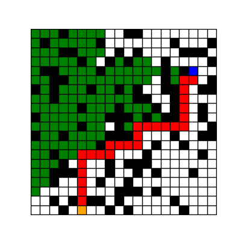
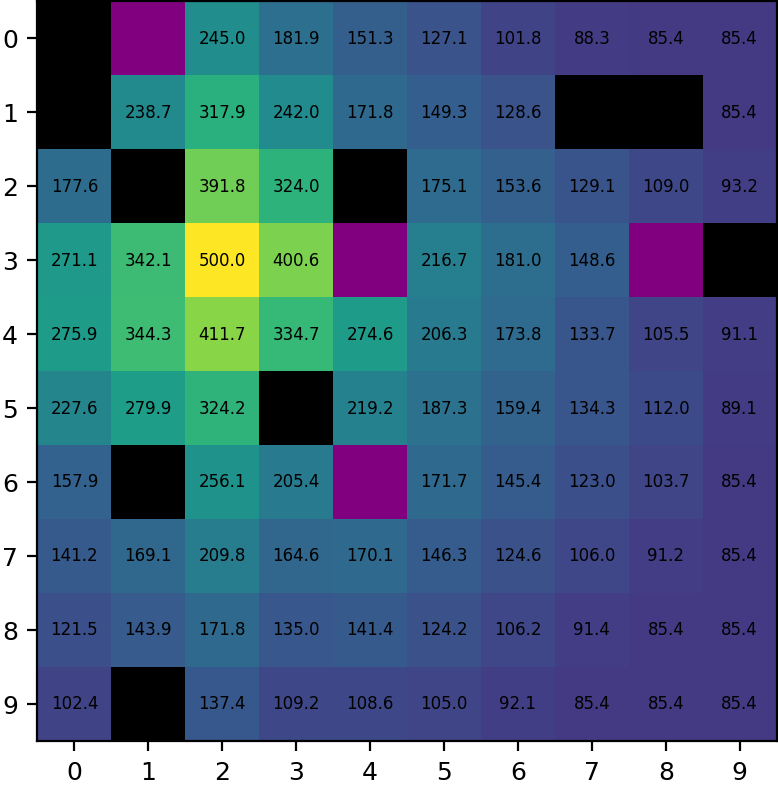
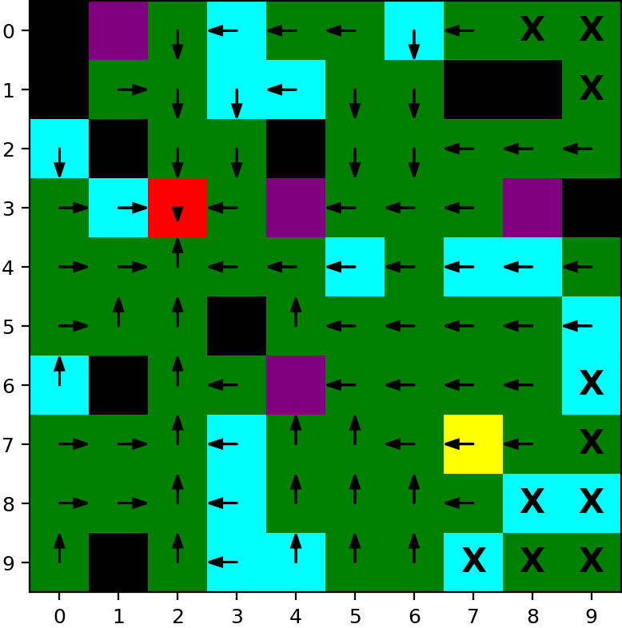

# PDM4AR Exercises

This repository contains the exercises of the course [Planning and Decision Making for Autonomous Robots](https://www.vvz.ethz.ch/Vorlesungsverzeichnis/lerneinheit.view?semkez=2025W&ansicht=KATALOGDATEN&lerneinheitId=194282&lang=de) with solutions by Tobias Vonäsch (Exercise 13 and 14 were solved in groups of three) 

## 02 - Graph Search
The goal of the exercise was to implement Breadth/Depth first algorithms. The detailed exercise description can be found [here](docs/02-graphsearch.md). This was achieved and the solution to some example data is shown below:

<table width="100%"> 
    <tr> 
        <td width="33.3%" align="center"> 
             
            
Breadth First Search
 
        </td> 
        <td width="33.3%" align="center"> 
             
            
Depth First Search
 
        </td> 
        <td width="33.3%" align="center"> 
             
Iterative Deepening Search
 
        </td> 
    </tr> 
</table>

More detailed output data can be viewed in the results file [here](/out/02/index.html).
## 03 - Informed Graph Search
As a continuation of the graph search exercise I implemented a uniform cost search and A*, which both run considerably faster than the course average. The detailed exercise description can be found [here](/docs/03-informedgraphsearch.md). 

<table width="100%"> 
    <tr> 
        <td width="50%" align="center"> 
             
            
A*
 
        </td> 
        <td width="50%" align="center"> 
             
            
Uniform Cost Search
 
        </td> 
    </tr> 
</table>

More detailed output data can be viewed in the results file [here](/out/03/index.html).
## 04 - Dynamic Programming
In this exercise I implemented a _Value_- and _Policy iteration_ to solve a stationary Markov Decision Process (MDP). The goal of the project was to guide a robot on a distant planet through a probabilistic environment to find unobtanium (a goal square). 
To achieve this, the distant world was discretized and each world cell could take on one of 6 cell types:
- Goal
- Start
- Grass
- Swamp
- Wonderland
- Cliff

When the robot starts on any given cell and wishes to traverse to another cell, it can take one of 6 actions:
- One of the 4 cardinal directions
- Stay
- Abandon

Depending on the cell the robot started on, it has a certain chance to traverse to the intended cell or end up on another neighbouring cell. If the robot starts on a grass cell for example, it has a 75% chance to end up on the cell it intended to go and a 25% chance to land on one of the other three adjacent cells. The value and policy iteration algorithm takes into account the probabilistic nature of these state transitions and designs a decision matrix (MDP) deciding over the robot's next optimal action. This is achieved by iterating over the value function until it converges, applying the probabilistic state transitions at each step. Once converged, an ideal policy can be extracted from the value function. 
A more detailed task description can be found [here](/docs/05-dubinspath).

### Results
In the following are the results of my algorithm. More details on the performance of the two different algorithms can be found [here](/out/04/index.html).
#### Value iteration

<table width="100%"> <tr> <td width="50%" align="center">  
Value function
 </td> <td width="50%" align="center">  
Policy function
 </td> </tr> </table>
#### Policy Iteration

<table width="100%"> <tr> <td width="50%" align="center">  
Value function
 </td> <td width="50%" align="center">  
Policy function
 </td> </tr> </table>

## 05 - Dubins Path
The goal of this exercise was to find an optimal path for a simplified car (Dubins' Car) between two arbitrary points in planar 2D space. Two methods were used to generate such paths: 
- Dubins paths
- Cubic Hermite splines
A more detailed task description can be found [here](/docs/05-dubinspath) and more details on the performance of my solution can be found [here](/out/05/index.html).

  
Cubic spline vs. Dubins path comparison
 

## 13 - Satellite Docking
The goal of this exercise was to engineer a planner and a controller for a satellite of known dynamics using SCvx, the planning method used in 2021 by SpaceX to land their spaceship on a moving platform in the middle of the ocean. The method works by iteratively solving the convexified problem until the nonconvex part converges to zero. (More details on the method can be found in the paper [Convex Optimisation for Trajectory Generation](https://arxiv.org/pdf/2106.09125.pdf)). 

## 14 - Multiagent Collection

